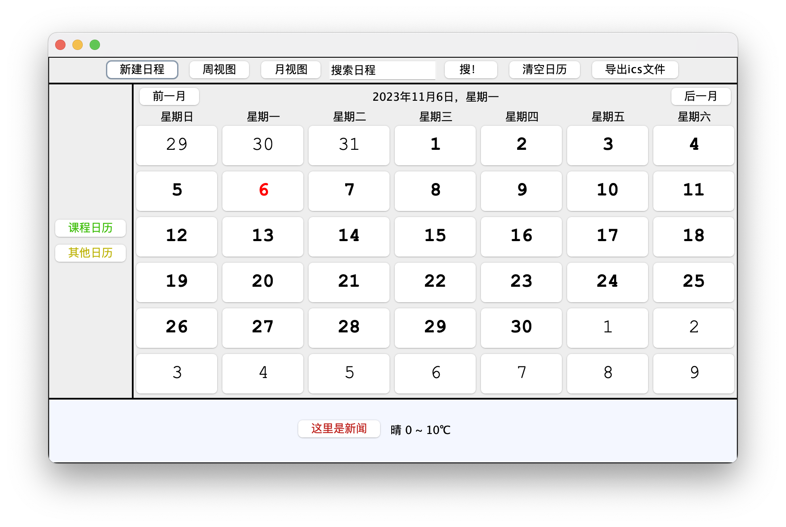

# Java Programming Course Project

JavaBank simulates a bank system.

LuckyPacketGrab is a game that simulates the process of grabbing lucky packets.

JavaCalendar is a calendae with UI and various functions, including switching views on the graphical interface, creating and exporting calendar ics files, switch different calendars and searching for news articles and routines.

